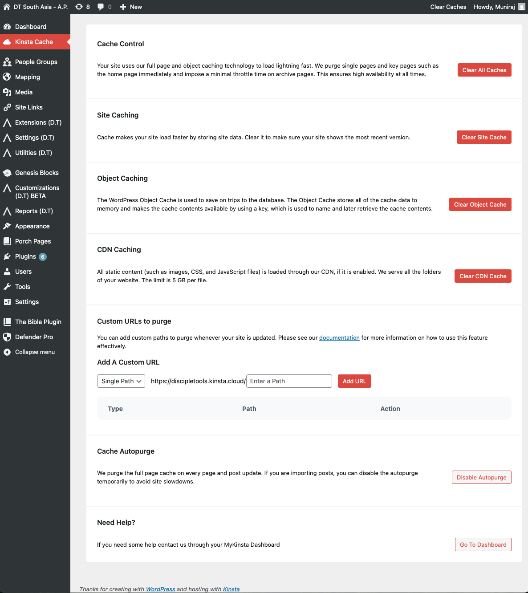

# Kinsta Caching

Within a [Kinsta](https://kinsta.com) deployment, there may be instances where Home Screen admin changes do not immediately take effect; due to Kinsta's default cache policy; which typically refreshes every 24 hours.

There are a number of approaches you could take in order to force a cache refresh. The first approach would be a manual clearing of the cache, either via MyKinsta, using WP-CLI or with the WordPress dashboard, as shown below:

Alternatively, if you require a more permanent solution, then [contact Kinsta support](https://kinsta.com/docs/support/contact-support/) and instruct them to disable page caching for specific URLs and paths.

Further details regarding Kinsta caching can be found below:

- [Edge Caching](https://kinsta.com/docs/wordpress-hosting/caching/edge-caching/)
- [Server Caching](https://kinsta.com/docs/wordpress-hosting/caching/site-caching/)
